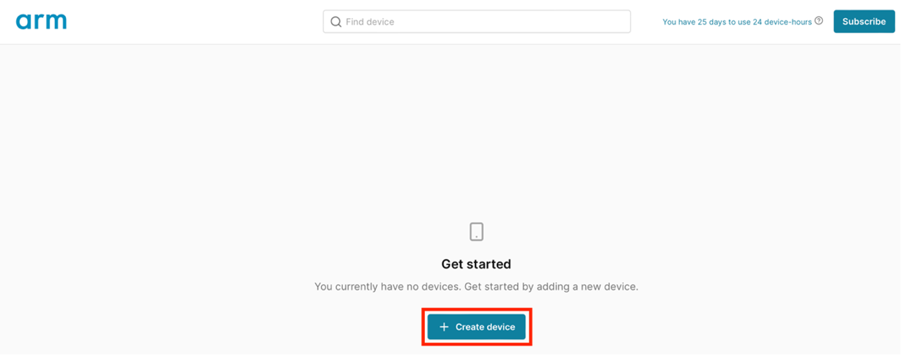
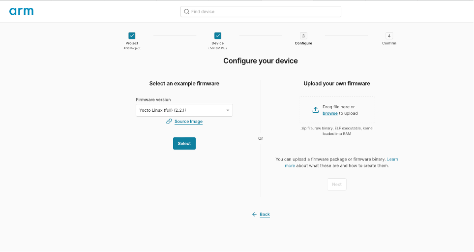
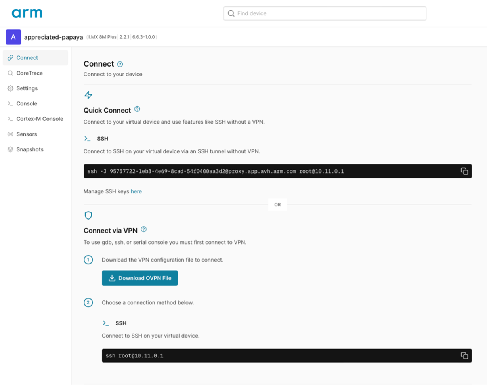

# AVH device setup

## Setup i.MX8M Plus model

AVH offers a 30-day free trial to use.
-	Create an account in AVH. https://app.avh.arm.com/login 
-	Once logged in, you should see a similar screen as shown below. 
-	Click on create device.
 
-	Click on Default Project
 
-	Select the i.MX 8M Plus device.
 
-	Select the Yocto Linux (full) (2.2.1) image
 
-	Click Select
 
-	Click on Create device, this could take few minutes.

-	A console to Linux running on the Cortex-A should appear. use “root” to login.

-	Run ip addr to find the ip address for the board model. This will be needed to ssh into the device.
 
PS: the GUI on the right side doesn’t always work for some reason, if you see the error shown in the picture above, just ignore it and continue with the demo.

Final step is deleting an unnecessary file in the AVH model that is taking up space: 
rm /home/root/demo.mp4

## Useful AVH tips

 
The “connect” pane shows the different ways that you can connect to the simulated board. The ip address specified should be the same as that visible in the output of the ip addr command. 

“Quick connect” allows you to ssh/scp to the AVH model without having to use a VPN configuration. In order to use Quick connect, it is necessary to add your ed25519 public key via the “manage ssh keys” here link.
PS: to generate an ssh key, you can run on your machine:  ssh-keygen -t ed25519
