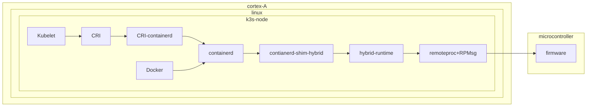

## Hybrid Runtime

### Name

hybrid-runtime - a OCI runtime for hybrid systems.

### Description

hybrid-runtime is a cli for running embedded apps on hybrid systems (on microcontrollers) that follows the Open Container Initiative format.

### Synopsis

The runtime must support commands with the following templates:

`hybrid-runtime [global-options] <COMMAND> [command-specific-options] <command-specific-arguments>`

- OCI compatibility, the runtime should implement the [OCI runtime specification](https://github.com/opencontainers/runtime-spec), this means it should idealy implement the following commands. however, we are restricted by what is possible in remoteproc (lifecycle management for remote processors)

    - `create`: creates a container.
    - `start`: starts a container.
    - `state`: outputs the state of a container.
    - `delete`: deletes a container. ==> stops the firmware running and from docker/k3s side deletes the container.
    - `list`: list containers started with the hybrid runtime
    - `exec`, `kill`, `list`, `checkpoint`, `events`, `restore`, `resume`, `run`, `spec`, `update`, `pause` and `version` are out of scope for this runtime.

- [Image spec](https://github.com/opencontainers/image-spec/blob/main/image-index.md).


### High level flow




#### Hybrid Runtime CLI

Run `hybrid-runtime`

```
# ./hybrid-runtime 

Deploy an application across available embedded cores.

Usage: hybrid-runtime <COMMAND>

Commands:
  create  Create a container
  start   Start a created container
  state   Output the state of a container
  kill    terminates the container
  delete  Deletes any resources held by the container
  help    Print this message or the help of the given subcommand(s)

Options:
  -h, --help     Print help
  -V, --version  Print version
```
- Create container: we can either provide the path to a local firmware or the name of a docker image, both followed by a unique container ID of your choosing. Run `hybrid-runtime create --help`

```
# ./hybrid-runtime create --help
Create a container

Usage: hybrid-runtime create <--firmware <FIRMWARE>|--image <IMAGE>> <CONTAINER_ID>

Arguments:
  <CONTAINER_ID>  container ID name for the instance of the container that you are starting. The name you provide for the container instance must be unique on your host

Options:
  -f, --firmware <FIRMWARE>  Path to the firmware directory, defaults value doesn't make sense here
  -i, --image <IMAGE>        Firmware container image name
  -h, --help                 Print help
```

- Start: start a created container

```
# ./hybrid-runtime start --help
Start a created container

Usage: hybrid-runtime start <CONTAINER_ID>

Arguments:
  <CONTAINER_ID>  container ID

Options:
  -h, --help  Print help
```

- Delete: deletes a container

```
root@imx8mm-lpddr4-evk:~# ./hybrid-runtime delete
Deletes any resources held by the container

Usage: hybrid-runtime delete [OPTIONS] <CONTAINER_ID>

Arguments:
  <CONTAINER_ID>  container ID

Options:
  -f, --force  Forcibly deletes the container if it is still running (using SIGKILL)
  -h, --help   Print help
```

- State: Output the state of a container {created, running, stopped}

### Build firmware container

This should be done in multiple steps in a Dockerfile. Dockerfile will be split, first part to download the sdk and build the firmware, second part to copy the firmware to a scratch image.
- Download SDK for the specific board from the nxp website. (need to create an account to be able to download the sdk)
- Build the right firmware
- Copy the firmware to a scratch image, this will allow us to have an OCI compatible image (so it can be managed by dockerhub for example) with a minimal size, we don't need any lib/OS specific files hence the use of scratch as a base image. The preduced image has a single layer containing the firmware.

example Dockerfile would look something like: 
```sh
FROM scratch
COPY --from=build /sdk/boards/evkmimx8mm/demo_apps/release/hello_world.elf /hello_world.elf
ENTRYPOINT [ "hello_world.elf" ]
```

- We use annotations while building the image to specify which board / SoC / MCU the firmware is for, this will be needed to match the image to the right board. To build an image with annotations in docker just add ` --output "type=docker,name=target,annotation[linux/arm64].board=imx8m-mini,mcu=cortex-m4" ` to the build command, for example the previous line adds two annotations `board = imx8m-mini` and `mcu = cortex-m4`.
- For the hybrid runtime

This info can be retrieved under `/sys/firmware/devicetree/base/compatible`
```sh
model = "FSL i.MX8MM EVK board";
compatible = "fsl,imx8mm-evk\0fsl,imx8mm";
```

another part of the decompiled device tree 
```sh
imx8mm-cm4 {
		compatible = "fsl,imx8mm-cm4";
		rsc-da = <0xb8000000>;
		clocks = <0x02 0x4d>;
		mbox-names = "tx\0rx\0rxdb";
		mboxes = <0x82 0x00 0x01 0x82 0x01 0x01 0x82 0x03 0x01>;
		memory-region = <0x83 0x84 0x85 0x86>;
		syscon = <0x23>;
		fsl,startup-delay-ms = <0x1f4>;
	};
```